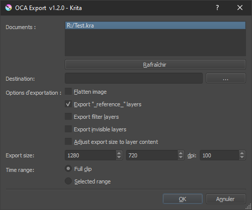

# OCA for Krita

[*OCA*, the Open Cel Animation format](https://github.com/Rainbox-dev/OCA) is an open format to ease the exchange of traditionnal/frame-by-frame/cel animation between different applications.

It is able to export all animation keyframes from a Krita document, keeping the layer structure, blending modes, and a lot of other information. This *OCA* format can then be imported in another application like *Adobe After Effects* or [*Blender*](http://blender.org).

The documentation about *OCA* is available on [oca-docs.rainboxlab.org](http://oca-docs.rainboxlab.org).

This is the *OCA* exporter for Krita.

## Features

This *OCA* exporter will export the most common features of all drawing/animation software:

- Exports the layers or the flattened image
- Layer Groups (and pass through mode if any)
- Layer Labels
- Layer Visibility
- Keyframes and their duration (animation exposure)
- Opacity Keyframes
- Blending Modes
- Layer Sizes and Coordinates
- Document background color
- Document color depth

## How to install OCA for Krita

This plugin is installed the same way as other Krita plugins.

### Using the plugin importer

First, if you're using the source code instead of a zipped release, you'll have to zip all the files and folders in the [src](src/) subfolder (the *OCA.desktop* file and the *OCA* folder).

1. Open the Script Importer plugin in Krita via `Tools ‣ Scripts ‣ Import Python Plugin...`
2. Locate and import the *OCA.zip* file.
3. Restart Krita
4. Go to `Settings ‣ Configure Krita...`
5. In the `Python Plugin Manager` tab, enable the *OCA* plugin
6. Restart Krita

### Manually

1. Copy (or symlink if you're developping) both the *OCA.desktop* file and the *OCA* folder to the *pykrita* subfolder of the Krita resources folder.
2. Start Krita
3. Go to `Settings ‣ Configure Krita...`
4. In the `Python Plugin Manager` tab, enable the *OCA* plugin
5. Restart Krita

!!! note
    To find your resources folder, start Krita and click the `Settings ‣ Manage Resources…` menu item. This will open a dialog box. Click the `Open Resources Folder` button.

## License

### Software

**Copyright (C)  2020 Nicolas Dufresne and Contributors.**  
This program is free software; you can redistribute them and/or modify them under the terms of the GNU General Public License as published by the Free Software Foundation; either version 3 of the License, or (at your option) any later version.

This program is distributed in the hope that it will be useful, but WITHOUT ANY WARRANTY; without even the implied warranty of MERCHANTABILITY or FITNESS FOR A PARTICULAR PURPOSE. See the GNU General Public License for more details.

You should have received a copy of the *GNU General Public License* along with *DuBuilder*. If not, see [http://www.gnu.org/licenses/](http://www.gnu.org/licenses/).

### This Documentation

**Copyright (C)  2020 Nicolas Dufresne and Contributors.**  
Permission is granted to copy, distribute and/or modify this document under the terms of the GNU Free Documentation License, Version 1.3 or any later version published by the Free Software Foundation;  
with no Invariant Sections, no Front-Cover Texts, and no Back-Cover Texts.
A copy of the license is included in the section entitled "[Documentation License](licenses/gfdl.md)".

 